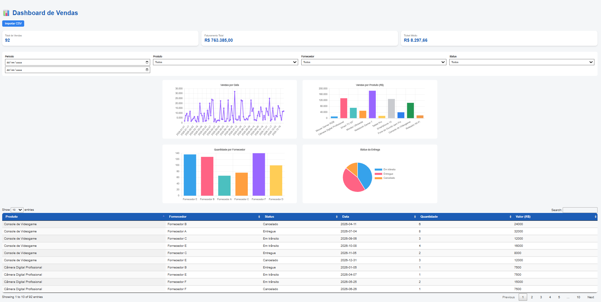

# 📊 Dashboard de Vendas – HTML + JavaScript

Dashboard interativo desenvolvido em HTML, CSS e JavaScript puro para análise de dados de vendas a partir de arquivos CSV.

## 🚀 Funcionalidades
- Upload dinâmico de arquivos CSV
- KPIs executivos (Faturamento, Quantidade, Ticket Médio)
- Filtros por Período, Produto, Fornecedor e Status 
- Gráficos interativos (Chart.js)
- Tabela dinâmica com busca e ordenação
- Atualização em tempo real conforme filtros

## 🛠 Tecnologias
- HTML
- CSS
- JavaScript
- Chart.js
- PapaParse
- DataTables
- IA (ChatGPT e Gemini)

## 📈 KPIs analisados
- Total de Vendas
- Faturamento Total
- Ticket Médio

## ▶️ Como executar
1. Baixe o repositório
2. Abra o arquivo `dashboard_vendas.html` no navegador
3. Importe um arquivo CSV de vendas

## 📷 Preview

## 👩‍💻 Autora
Fabiana Gomes Lancellotti  
Transição de carreira para Data Analytics / BI
